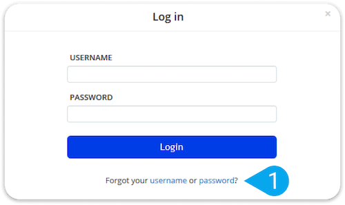

# **Forms and Events**

> ## Ch. 7 - “Forms”

- Form is an element that allows you to input information in a page. Like a search bar or username entry to check boxes and even selecting buttons.

> example:

```html

<form action="some website.com/login">
  <p>Username:
    <input type="text" name="username" size="12"
    maxlength="25"/>
  </p>
  <p>Password:
    <input type="password" name="password" size="12"
    maxlength="25"/>
  </p>
    </form>
    
  ```

- This will create something like shown below



- There are other typs such as radio buttons and checkboxes that you can utilize in you html.

> ## Ch.14 - “Lists, Tables & Forms”

- This chapter dives into the the styling of lists,tables, and forms through html and css.

- You are able to manupulate and express you elements in various ways. 

[^1]: see example below of a list item

```css

ul{
  list-style-image: url("images/somepictureofacat.png");
}
li{
  magrin: 7px 0px 0px 0px;
}
```

This would have a picture of whatever cat as your marker for your unordered list.  Pretty cool.

>## Ch. 6 - “Events”

- Events types:
  
  - ui events
    
    - load
    - unload
    - error
    - resize
  - keyboard events
    -keydown
    - keyup
    - keypress
  - mouse events
    - click
    - double click
    - mouse down
    - mouse up

- You can create functions to activate these series of events.